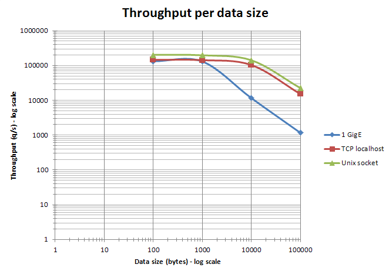

Redis 包括 `redis-benchmark` 实用程序，它模拟同时发送 M 个总查询的 N 个客户端执行的命令。该实用程序提供默认的一组测试，或者您可以提供自定义的一组测试。

支持以下选项：

    Usage: redis-benchmark [-h <host>] [-p <port>] [-c <clients>] [-n <requests]> [-k <boolean>]

     -h <hostname>      Server hostname (default 127.0.0.1)
     -p <port>          Server port (default 6379)
     -s <socket>        Server socket (overrides host and port)
     -a <password>      Password for Redis Auth
     -c <clients>       Number of parallel connections (default 50)
     -n <requests>      Total number of requests (default 100000)
     -d <size>          Data size of SET/GET value in bytes (default 3)
     --dbnum <db>       SELECT the specified db number (default 0)
     -k <boolean>       1=keep alive 0=reconnect (default 1)
     -r <keyspacelen>   Use random keys for SET/GET/INCR, random values for SADD
      Using this option the benchmark will expand the string __rand_int__
      inside an argument with a 12 digits number in the specified range
      from 0 to keyspacelen-1. The substitution changes every time a command
      is executed. Default tests use this to hit random keys in the
      specified range.
     -P <numreq>        Pipeline <numreq> requests. Default 1 (no pipeline).
     -q                 Quiet. Just show query/sec values
     --csv              Output in CSV format
     -l                 Loop. Run the tests forever
     -t <tests>         Only run the comma separated list of tests. The test
                        names are the same as the ones produced as output.
     -I                 Idle mode. Just open N idle connections and wait.

在启动基准测试之前，您需要有一个正在运行的Redis实例。
您可以像这样运行基准测试工具：

    redis-benchmark -q -n 100000

### 仅运行一部分测试

您无需每次执行“redis-benchmark”时都运行所有默认测试。
例如，要仅选择一部分测试，请使用“-t”选项，
如以下示例所示：

    $ redis-benchmark -t set,lpush -n 100000 -q
    SET: 74239.05 requests per second
    LPUSH: 79239.30 requests per second

这个示例运行`SET`和`LPUSH`命令的测试，并使用安静模式（参见`-q`开关）。

您甚至可以对特定命令进行基准测试：

    $ redis-benchmark -n 100000 -q script load "redis.call('set','foo','bar')"
    script load redis.call('set','foo','bar'): 69881.20 requests per second

### 选择密钥空间的大小

默认情况下，基准测试针对单个键运行。在Redis中，这样的合成基准测试和真实基准测试之间的差异不大，因为它是一个内存系统，但是可以通过使用大型键空间来强调缓存未命中，并模拟更真实的工作负载。

这是通过使用`-r`开关获得的。例如，如果我想运行一百万个SET操作，每个操作都使用100k个可能键中的一个随机键，我将使用以下命令行：

    $ redis-cli flushall
    OK

    $ redis-benchmark -t set -r 100000 -n 1000000
    ====== SET ======
      1000000 requests completed in 13.86 seconds
      50 parallel clients
      3 bytes payload
      keep alive: 1

    99.76% `<=` 1 milliseconds
    99.98% `<=` 2 milliseconds
    100.00% `<=` 3 milliseconds
    100.00% `<=` 3 milliseconds
    72144.87 requests per second

    $ redis-cli dbsize
    (integer) 99993

### 使用流水线技术

默认情况下，每个客户端（如果没有通过参数“-c”明确指定，则模拟50个客户端）仅在收到前一个命令的回复后才发送下一个命令，这意味着服务器可能需要执行读取操作来从每个客户端读取每个命令。此外，还需要支付往返时延（RTT）。

Redis支持[流水线](/topics/pipelining)，因此可以一次发送多个命令，这是现实世界应用程序经常利用的一个特性。Redis流水线能够显著提高服务器每秒操作数量。

考虑以下示例，使用流水线处理16条指令来运行基准测试：

    $ redis-benchmark -n 1000000 -t set,get -P 16 -q
    SET: 403063.28 requests per second
    GET: 508388.41 requests per second

使用管道技术能够显著提高性能。

### 陷阱和误解

第一点是显而易见的：一个有用的基准测试的黄金法则是只比较相同的事物。你可以比较不同版本的Redis在相同的工作负载上的表现或者相同版本的Redis在不同选项下的表现。如果你计划将Redis与其他东西进行比较，那么评估功能和技术上的差异，并考虑它们是非常重要的。

+ Redis是一个服务器：所有命令都涉及网络或IPC往返。将其与嵌入式数据存储进行比较是没有意义的，因为大多数操作的成本主要在于网络/协议管理。
+ Redis命令对于所有常规命令都返回确认。其他一些数据存储则不会。将Redis与只涉及单向查询的存储进行比较只有轻微的用处。
+ 简单地迭代同步的Redis命令并不能对Redis本身进行基准测试，而是测量了你的网络（或IPC）延迟和客户端库的固有延迟。要真正测试Redis，你需要多个连接(如redis-benchmark)，和/或使用流水线来聚合几个命令，和/或多个线程或进程。
+ Redis是一种带有一些可选持久性选项的内存数据存储。如果你计划将其与事务服务器（如MySQL，PostgreSQL等）进行比较，则应考虑激活AOF并决定适合的fsync策略。
+ Redis在命令执行的观点上主要是单线程的服务器（实际上现代版本的Redis在不同的情况下使用了线程）。它并没有设计成从多个CPU核心中获益。如果需要，人们可以启动多个Redis实例以在多个核心上进行扩展。将一个Redis实例与多线程的数据存储进行比较是不公平的。

`redis-benchmark`程序是一种快速、有用的方法，可以获得一些数字，并评估给定硬件上Redis实例的性能。然而，默认情况下，它不能代表Redis实例可以承受的最大吞吐量。实际上，通过使用流水线和快速客户端（hiredis），编写一个生成比redis-benchmark更高吞吐量的程序是相当容易的。redis-benchmark的默认行为是仅仅通过利用并发性来达到吞吐量（即它创建多个到服务器的连接）。它不使用流水线或任何并行性（最多每个连接一个等待查询，且没有多线程），除非通过`-P`参数显式启用。因此，以某种方式使用`redis-benchmark`，并在同一时间触发后台的`BGSAVE`操作，将为用户提供与“最差情况”更接近而不是最佳情况的数字。

为了以管线模式运行基准测试（并实现更高的吞吐量），您需要显式使用-P选项。请注意，这仍然是一个现实的行为，因为许多基于Redis的应用程序积极使用管线以提高性能。然而，您应该使用一个大致是您的应用程序中可以使用的平均管线长度的管线大小，以获得真实的数字。

该基准测试应使用相同的操作并以相同的方式与您想要比较的多个数据存储一起工作。将redis-benchmark的结果与其他基准测试程序的结果进行比较并进行外推是完全没有意义的。

例如，可以在单线程模式下比较Redis和memcached的GET/SET操作。两者都是内存数据存储，基本上在协议层面上的工作方式是相似的。如果它们各自的基准应用以相同的方式（流水线技术）聚合查询并且使用相似数量的连接，那么比较实际上是有意义的。

当你在对高性能的内存数据库如Redis进行基准测试时，可能会很难让服务器达到饱和状态。有时，性能瓶颈在客户端上，而不是服务器端。在这种情况下，客户端（即基准测试程序本身）必须被修复，或者可能需要扩展以达到最大吞吐量。

### 影响Redis性能的因素

以下是多个直接影响Redis性能的因素。
我们在这里提到它们，因为它们可能会改变任何基准测试的结果。
然而，请注意，一个运行在低端未调优的服务器上的典型Redis实例通常对大多数应用程序来说性能已经足够好了。

+ 网络带宽和延迟通常直接影响性能。
在启动基准测试之前，使用ping程序快速检查客户端和服务器主机之间的延迟是否正常是一个好习惯。
关于带宽，通常有用的是估算吞吐量（以Gbit/s为单位）并与网络的理论带宽进行比较。例如，在Redis中设置4 KB的字符串并以100000 q/s操作时，实际上会消耗 3.2 Gbit/s 的带宽，可能适合在 10 Gbit/s 的链路上运行，但不适合在 1 Gbit/s 的链路上运行。在许多真实场景中，Redis的吞吐量受到网络限制，而不是CPU的限制。为了在单个服务器上整合多个高吞吐量的Redis实例，值得考虑使用一个 10 Gbit/s 的网卡或多个带有TCP/IP绑定的 1 Gbit/s 的网卡。
+ CPU是另一个非常重要的因素。由于Redis是单线程的，它偏好具有大缓存和不太多核心的快速CPU。在这个方面，英特尔的CPU目前是冠军。与使用Redis相似的Nehalem EP/Westmere EP/Sandy Bridge英特尔CPU相比，通常可以在AMD Opteron CPU上获得的性能只有一半。当客户端和服务器在同一台机器上运行时，CPU是redis-benchmark性能的限制因素。
+ RAM的速度和内存带宽对于全局性能来说似乎不那么关键，特别是对于小对象来说。对于大对象（>10 KB），尽管可能会变得明显起来。通常，购买昂贵的高速内存模块来优化Redis并不是真正具有成本效益的。
+ 在与不使用虚拟化相同的硬件上运行时，Redis在虚拟机上运行时速度较慢。如果你有机会在物理机上运行Redis，这是首选的。但是，这并不意味着Redis在虚拟化环境中很慢，其性能仍然非常好，并且在虚拟化环境中可能遇到的大多数性能问题都是由于过度配置、具有高延迟的非本地磁盘或具有缓慢的`fork`系统调用实现的老虚拟化软件引起的。
+ 当服务器和客户端基准测试程序在同一台机器上运行时，可以使用TCP/IP回环和UNIX域套接字。根据平台的不同，UNIX域套接字的吞吐量可以比TCP/IP回环高出约50%（例如在Linux上）。redis-benchmark的默认行为是使用TCP/IP回环。
+ 与TCP/IP回环相比，UNIX域套接字的性能优势在有大量使用流水线的情况下（即长流水线）会逐渐减少。
+ 当以太网用于访问Redis时，使用流水线聚合命令在数据大小保持在以太网数据包大小（约1500字节）以下的情况下是特别高效的。实际上，处理10字节、100字节或1000字节的查询几乎会产生相同的吞吐量。请参见下面的图表。

    

+ 在多个CPU插槽服务器上，Redis的性能将取决于NUMA配置和进程位置。最明显的影响是redis-benchmark的结果似乎是不确定的，因为客户端和服务器进程是随机分布在内核上的。要获得确定性的结果，需要使用进程定位工具（在Linux上是taskset或numactl）。最高效的组合始终是将客户端和服务器放在同一CPU的两个不同内核上，以从L3缓存中获得好处。
以下是在具有不同相对位置的3个服务器CPU（AMD Istanbul、Intel Nehalem EX和Intel Westmere）上进行的4 KB SET基准测试的一些结果。请注意，此基准测试不旨在比较CPU型号之间的差异（因此不公开详细的CPU型号和频率）。

    

+ 超高的配置同时也会导致客户端连接数变成一个重要因素。Redis基于epoll/kqueue的事件循环非常可扩展。Redis已经在60000个连接上进行了基准测试，在这些条件下仍然能够维持每秒50000次的吞吐量。根据经验，一个拥有30000个连接的实例只能处理拥有100个连接时可实现的一半吞吐量。下面是一个示例，展示了Redis实例在不同连接数下的吞吐量：

    

* 通过调整网卡配置和相关中断, 可以通过高端配置实现更高的吞吐量. 通过将Rx/Tx网卡队列与CPU核心进行亲和性设置，并启用RPS（接收数据包分流） ，可以实现最佳吞吐量. 更多信息请参考 [本文](https://groups.google.com/forum/#!msg/redis-db/gUhc19gnYgc/BruTPCOroiMJ).
* 当使用大对象时，巨型帧也可以提供性能提升。
* 根据平台的不同, Redis可以编译为使用不同的内存分配器(libc malloc, jemalloc, tcmalloc)，这些分配器在原始速度、内部和外部碎片化方面会有不同的行为。
如果您没有自己编译Redis, 您可以使用INFO命令检查 `mem_allocator` 字段。请注意，大多数基准测试无法运行足够长的时间以生成显著的外部碎片化(与生产Redis实例相反)。

### 其他需要考虑的事项

任何基准测试的一个重要目标是获取可重复的结果，以便与其他测试结果进行比较。

+ 一个良好的实践是尽可能在隔离的硬件上运行测试。
如果不可能的话，那么必须监控系统以检查基准测试不受外部活动的影响。
+ 一些配置（包括桌面和笔记本电脑，以及某些服务器）有一个可变的CPU核心频率机制。控制该机制的策略可以在操作系统级别进行设置。某些CPU型号在适应CPU核心的工作负载时比其他型号更具侵略性。为了获得可重复的结果，最好为参与基准测试的所有CPU核心设置最高可能的固定频率。
+ 一个重要的点是根据基准测试来调整系统的大小。系统必须有足够的RAM，并且不能进行交换。在Linux上，请不要忘记正确设置 `overcommit_memory` 参数。请注意，32位和64位Redis实例的内存占用是不同的。
+ 如果计划在基准测试中使用RDB或AOF，请确保系统中没有其他I/O活动。避免将RDB或AOF文件放在NAS或NFS共享上，或者放在其他影响网络带宽和/或延迟的设备上（例如，Amazon EC2上的EBS）。
+ 将Redis的日志级别（loglevel参数）设置为warning或notice。避免将生成的日志文件放在远程文件系统上。
+ 避免使用可能会改变基准测试结果的监控工具。例如，以固定间隔使用INFO来收集统计信息可能是可以的，但使用MONITOR将显著影响测得的性能。

### 其他Redis性能基准测试工具

有几个第三方工具可用于对Redis进行基准测试。有关其目标和功能的更多信息，请参阅每个工具的文档。

* [memtier_benchmark](https://github.com/redislabs/memtier_benchmark) 来自 [Redis Ltd.](https://twitter.com/RedisInc) 是一个用于生成和基准测试 NoSQL Redis 和 Memcache 流量的工具。
* [rpc-perf](https://github.com/twitter/rpc-perf) 来自 [Twitter](https://twitter.com/twitter) 是一个用于基准测试支持 Redis 和 Memcache 的 RPC 服务的工具。
* [YCSB](https://github.com/brianfrankcooper/YCSB) 来自 [Yahoo @Yahoo](https://twitter.com/Yahoo) 是一个包含对多个数据库客户端的基准测试框架，其中包括 Redis。
