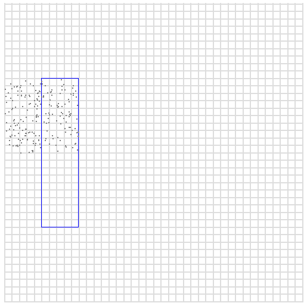

Redis并不完全是一个键值存储，因为值可以是复杂的数据结构。然而，在API级别上，Redis有一个外部的键值外壳：数据通过键名进行访问。可以说，Redis仅支持*主键访问*。然而，由于Redis是一个数据结构服务器，它的功能可以用来进行索引，从而创建不同类型的二级索引，包括复合（多列）索引。

本文档介绍了如何使用以下数据结构在Redis中创建索引：

* 通过ID或其他数字字段创建二级索引的有序集合。
* 通过字典排序范围创建更高级的二级索引、复合索引和图遍历索引的有序集合。
* 创建随机索引的集合。
* 通过列表创建简单可迭代索引和最新 N 项索引。

用Redis实现和维护索引是一个高级主题，因此大多数需要对数据执行复杂查询的用户应该明白他们是否更适合使用关系型存储。然而，通常情况下，特别是在缓存场景中，有明确的需要将索引数据存储到Redis中，以加速需要某种形式的索引才能执行的常见查询。

使用有序集合的简单数字索引

通过使用Redis的有序集合数据类型，你可以创建最简单的二级索引。有序集合是一种数据结构，它代表了一个按浮点数排序的元素集合，可以作为二级索引的数据类型。元素按照分数从小到大的顺序排列。

由于分数是双精度浮点数，您可以使用普通排序集来构建索引，但限制在索引字段为特定范围内的数字的情况。

构建这类索引的两个命令是`ZADD`和`ZRANGE`，分别用`BYSCORE`参数添加项目和检索指定范围内的项目。

例如，可以通过将元素添加到排序集合来根据年龄索引一组人名。元素将是人的姓名，成绩将是年龄。

    ZADD myindex 25 Manuel
    ZADD myindex 18 Anna
    ZADD myindex 35 Jon
    ZADD myindex 67 Helen

为了检索年龄在20至40之间的所有人员，可以使用以下命令：

    ZRANGE myindex 20 40 BYSCORE
    1) "Manuel"
    2) "Jon"

通过使用`ZRANGE`命令的**WITHSCORES**选项，还可以获取与返回元素相关联的分数。

`ZCOUNT`命令可以用于检索给定范围内元素的数量，而无需实际获取元素，这非常有用，尤其是考虑到操作在对数时间内执行，而与范围的大小无关。

范围可以是包括的或排除的，请参考`ZRANGE`命令文档以获取更多信息。

**注意**：使用`ZRANGE`命令的`BYSCORE`和`REV`参数，可以以相反的顺序查询范围，这在数据按某个方向（升序或降序）索引，但我们希望以相反的方式检索信息时非常有用。

使用对象ID作为关联值
---

在上面的示例中，我们将名称与年龄关联起来。然而，通常我们可能希望索引存储在其他位置的对象的某个字段。不必直接使用排序集合值来存储与索引字段相关联的数据，而是只存储对象的ID。

例如，我可能有代表用户的Redis哈希。每个用户由一个单一的键表示，通过ID直接访问：

    HMSET user:1 id 1 username antirez ctime 1444809424 age 38
    HMSET user:2 id 2 username maria ctime 1444808132 age 42
    HMSET user:3 id 3 username jballard ctime 1443246218 age 33

如果我想按照用户的年龄创建一个索引来查询用户，可以这样写:

    ZADD user.age.index 38 1
    ZADD user.age.index 42 2
    ZADD user.age.index 33 3

这次与有序集合中的分数相关联的值是对象的ID。因此，一旦我使用`ZRANGE`命令带有`BYSCORE`参数进行查询索引，我还必须使用`HGETALL`或类似的命令检索所需的信息。明显的优势是，只要我们不更改索引字段，对象可以更改而不影响索引。

在接下来的例子中，我们几乎总是使用ID作为与索引相关联的值，因为这通常是更有意义的设计，有一些例外。

更新简单的排序集索引
---

通常我们对随时间而变化的事物进行索引。在上面的例子中，用户的年龄每年都会变化。在这种情况下，使用出生日期作为索引而不是年龄本身是有意义的，但在其他情况下，我们只是希望某些字段随时间而变化，索引也要反映这种变化。

`ZADD`命令可以使更新简单索引变为非常轻松的操作，因为重新添加一个具有不同分数但相同值的元素只会更新分数并将元素移动到正确的位置，所以如果用户`antirez`变为39岁，为了更新代表该用户的哈希和索引中的数据，我们需要执行以下两条命令：

    HSET user:1 age 39
    ZADD user.age.index 39 1

操作可能会被包装在一个`MULTI`/`EXEC`事务中，以确保两个字段都被更新或者都不被更新。

将多维数据转换为线性数据
---

使用有序集合创建的索引只能索引单个数值。由于这个原因，你可能会认为使用这种索引无法索引具有多个维度的内容，但实际上并不总是如此。如果你能以高效的线性方式表示多维数据，那么通常可以使用简单的有序集合进行索引。

例如，[Redis地理索引API](/commands/geoadd)使用排序集合来按纬度和经度索引地点，使用一种叫做[Geo hash](https://en.wikipedia.org/wiki/Geohash)的技术。排序集合的分数代表经度和纬度的交错位，因此我们可以将排序集合的线性分数映射到地球表面上的许多小“方块”中。通过执行一个8+1样式的中心加邻域搜索，可以按半径检索元素。

得分的限制
---

排序集合元素的分数是双精度浮点数。这意味着它们可以代表不同的小数或整数值，并且有不同的误差，因为它们在内部使用指数表示法。然而，对于索引目的来说，有趣的是分数始终能够在-9007199254740992和9007199254740992之间无误差地表示数字，即“-/+ 2^53”。

在表示更大的数字时，您需要一种能够以任意精度索引数字的不同索引形式，称为词典索引。

词典索引
===

Redis有一项有趣的特性：当元素具有相同的分数时，它们会按字典顺序排序，使用`memcmp（）`函数将字符串作为二进制数据进行比较。

对于不了解C语言和`memcmp`函数的人来说，它的意思是通过逐字节比较它们的原始值来对具有相同分数的元素进行排序。如果第一个字节相同，则检查第二个字节，依此类推。如果两个字符串的共同前缀相同，则较长的字符串被认为是两者中较大的，因此"foobar"大于"foo"。

有诸如`ZRANGE`和`ZLEXCOUNT`这样的命令可以按字典顺序查询和计数范围，
假设它们与排序集合一起使用，并且所有元素都有相同的分数。

这个Redis功能基本上相当于一个`b-tree`数据结构，它经常用于实现传统数据库的索引。
正如你猜到的那样，因为这个原因，可以使用Redis数据结构来实现相当复杂的索引。

在我们深入探讨词典索引的使用之前，让我们先来看看排序集合在这种特殊操作模式下的行为。由于我们需要添加具有相同分数的元素，所以我们将始终使用特殊分数零。

    ZADD myindex 0 baaa
    ZADD myindex 0 abbb
    ZADD myindex 0 aaaa
    ZADD myindex 0 bbbb

从排序集合中获取所有元素立即显示它们按字典顺序排序。

    ZRANGE myindex 0 -1
    1) "aaaa"
    2) "abbb"
    3) "baaa"
    4) "bbbb"

现在我们可以使用`ZRANGE`命令的`BYLEX`参数来执行范围查询。

    ZRANGE myindex [a (b BYLEX
    1) "aaaa"
    2) "abbb"

请注意，在范围查询中我们在 `min` 和 `max` 元素前面添加了特殊字符 `[` 和 `(` 来标识范围。
这些前缀是必需的，并且它们指定了范围的元素是包含还是排除。因此，范围 `[a (b` 的意思是给我所有以 `a` 开头的、字典顺序在 `a` 包含的元素和 `b` 排除的元素之间的元素。

还有两个特殊字符，用于表示无限负字符串和无限正字符串，分别是`-`和`+`。

    ZRANGE myindex [b + BYLEX
    1) "baaa"
    2) "bbbb"

这就是基本情况。让我们看看如何使用这些功能来构建索引。

一个第一个例子：完成

索引的一个有趣应用是自动补全。自动补全是当您开始在搜索引擎中输入查询时发生的情况：用户界面将预测您可能正在输入的内容，并提供以相同字符开头的常见查询。

一种天真的完成方法是将用户提供的每个查询都添加到索引中。例如，如果用户搜索“香蕉”，我们将执行以下操作：

    ZADD myindex 0 banana

对于每个搜索查询，都是这样。然后，当我们想要完成用户输入时，我们使用 `ZRANGE` 命令和 `BYLEX` 参数执行一个范围查询。
假设用户在搜索表单中输入“bit”，我们想要提供以“bit”开头的可能搜索关键字。我们发送给Redis一个类似的命令：

    ZRANGE myindex "[bit" "[bit\xff" BYLEX

基本上，我们使用用户当前输入的字符串作为起始点，以及相同的字符串加上一个末尾字节设置为255（在示例中为`\xff`）作为范围的结束点。这样，我们就能得到所有以用户所输入的字符串开头的字符串。

注意，我们不希望返回太多项目，所以我们可以使用**LIMIT**选项来减少结果的数量。

将频率加入混合料中
---

上述方法有点幼稚，因为以这种方式进行的所有用户搜索都是相同的。在一个真实的系统中，我们希望根据它们的频率来完成字符串：非常受欢迎的搜索将以较高的概率被建议，而很少被键入的搜索字符串则以较低的概率被建议。

为了实现依赖频率的功能，并且同时能够自动适应未来的输入，通过清除不再流行的搜索，我们可以使用一个非常简单的*流式算法*。

为了开始，我们修改了我们的索引，以便不仅存储搜索条目，还存储与条目关联的频率。因此，我们不仅仅添加`banana`，而是添加`banana:1`，其中1表示频率。

    ZADD myindex 0 banana:1

我们还需要逻辑来增加索引，如果搜索词已经存在于索引中，那么实际上我们要做的是这样的：

    ZRANGE myindex "[banana:" + BYLEX LIMIT 0 1
    1) "banana:1"

如果存在，这将返回“banana”的单个条目。然后我们可以递增相关频率并发送以下两个命令：

    ZREM myindex 0 banana:1
    ZADD myindex 0 banana:2

注意，由于可能存在并发更新的情况，上述三个命令应通过[Lua脚本](/commands/eval)发送，以便Lua脚本可以原子性地获取旧计数并增加得分重新添加该项。

所以结果就是，每当用户搜索“banana”时，我们的条目将被更新。

有更多：我们的目标只是要搜索非常频繁的项目。
因此，我们需要一种形式的清除。当我们实际查询索引以完成用户输入时，可能会看到如下内容：

    ZRANGE myindex "[banana:" + BYLEX LIMIT 0 10
    1) "banana:123"
    2) "banaooo:1"
    3) "banned user:49"
    4) "banning:89"

显然没有人搜索"banaooo"，例如，查询只执行了一次，所以我们将其呈现给用户。

以下是我们可以做的。从返回的项目中，我们随机选择一个，将其分数减1，然后以新的分数重新添加它。
然而，如果分数达到0，我们只需将该项目从列表中删除。
你可以使用更先进的系统，但核心思想是长期来看索引会包含热门搜索，并且如果热门搜索随时间而变化，索引将自动适应。

对此算法的改进是根据条目的权重选择列表中的条目：得分越高，选择的可能性越小，以减少其得分或驱逐它们。

字符串的大小写和重音标准化

在完成示例中，我们始终使用小写字符串。然而现实要复杂得多：语言中有大写字母名称、重音等等。

处理这些问题的一种简单方法是实际上对用户搜索的字符串进行规范化处理。无论用户搜索"香蕉"、"BANANA"还是"Ba'nana"，我们总是可以将其转换为"香蕉"。

然而，有时我们可能希望向用户呈现原始输入的项目，即使我们对字符串进行了标准化以供索引使用。为了做到这一点，我们所做的是更改索引的格式，以便不仅存储“term:frequency”，还存储“normalized:frequency:original”，如下例所示：

    ZADD myindex 0 banana:273:Banana

基本上，我们添加了另一个字段，我们将提取并仅用于可视化。范围将始终使用规范化的字符串进行计算。这是一个常见的技巧，具有多个应用。

在索引中添加辅助信息
---

当直接使用有序集合时，每个对象有两个不同的属性：分数（作为索引使用）和相关的值。而使用词典索引时，分数始终设为0，并且基本上不会被使用。我们只有一个单独的字符串，即元素本身。

就像我们在之前的完成示例中所做的那样，我们仍然可以使用分隔符来存储关联数据。例如，我们使用冒号来添加完成的频率和原始单词。

一般来说，我们可以给我们的索引键添加任何类型的关联值。
为了使用词典顺序索引来实现一个简单的键值存储
我们只需将条目存储为`键:值`：

    ZADD myindex 0 mykey:myvalue

使用以下命令搜索关键字：

    ZRANGE myindex [mykey: + BYLEX LIMIT 0 1
    1) "mykey:myvalue"

然后我们提取冒号后面的部分以检索值。
然而，在这种情况下需要解决的一个问题是碰撞。冒号字符
可能是键本身的一部分，因此必须选择一个不会
与我们添加的键发生冲突的字符。

由于Redis中的词典范围是二进制安全的，您可以使用任何字节或字节序列。但是，如果接收到不受信任的用户输入，则最好使用某种形式的转义来确保分隔符永远不会成为键的一部分。

例如，如果您使用两个空字节作为分隔符"\0\0"，您可能希望始终将空字节转义为字符串中的两个字节序列。

数值填充
---

词典索引在处理索引字符串的问题时可能看起来不错。实际上，使用这种索引以执行任意精度数字的索引非常简单。

在ASCII字符集中，数字的顺序是从0到9，因此如果我们使用前导零左填充数字，结果是按其数值对它们进行字符串比较。

    ZADD myindex 0 00324823481:foo
    ZADD myindex 0 12838349234:bar
    ZADD myindex 0 00000000111:zap

    ZRANGE myindex 0 -1
    1) "00000000111:zap"
    2) "00324823481:foo"
    3) "12838349234:bar"

我们使用一个可以无限大的数字字段有效地创建了索引。通过在数字部分前面用前导零填充，并在小数部分后面用尾随零填充，我们还可以处理任意精度的浮点数，就像以下数字列表中的情况一样:

        01000000000000.11000000000000
        01000000000000.02200000000000
        00000002121241.34893482930000
        00999999999999.00000000000000

以二进制形式使用数字
---

用十进制存储数字可能会占用过多的内存。另一种方法是直接以它们的二进制形式存储数字，例如128位整数。然而，为了使其工作，您需要以*大端字节序*存储数字，这样最高有效字节会在最低有效字节之前存储。这样当Redis使用`memcmp()`比较字符串时，它将按照数值有效地对数字进行排序。

请记住，以二进制格式存储的数据在调试过程中观察性较差，解析和导出较困难。因此，这绝对是一个权衡。

复合索引
===

到目前为止，我们探讨了索引单个字段的方法。然而，我们都知道SQL存储能够使用多个字段创建索引。例如，我可能会按照房间号和价格对一个非常大的商店的产品进行索引。

为了检索给定价格范围内给定房间中的所有产品，我需要运行查询。我可以通过以下方式对每个产品进行索引:

    ZADD myindex 0 0056:0028.44:90
    ZADD myindex 0 0034:0011.00:832

这里的字段是`room:price:product_id`。为了简单起见，我在示例中只使用了四位数字填充。辅助数据（即产品ID）不需要填充。

有了这样的索引，要获取56房间中价格在10到30美元之间的所有产品非常容易。我们只需运行以下命令:

    ZRANGE myindex [0056:0010.00 [0056:0030.00 BYLEX

以上被称为复合索引。它的有效性取决于字段的顺序和我想要运行的查询。例如，上述索引不能高效地用于获取所有具有特定价格范围的产品，而不考虑房间号。然而，我可以使用主键来运行与价格无关的查询，例如“给我房间44中的所有产品”。

复合索引非常强大，并且在传统存储中用于优化复杂查询。在Redis中，它们既可以用于实现一个非常快速的内存中Redis索引，来索引传统数据存储中存储的内容，也可以直接索引Redis数据。

更新字典索引
===

对于字典索引中的索引值，可能会变得相当复杂，而且从我们关于对象存储的信息中重新构建起来可能会很困难或者很慢。因此，为了简化索引的处理，可以使用更多的内存，同时在表示索引的有序集合旁边还要使用哈希映射，将对象ID映射到当前的索引值。

所以例如，当我们进行索引时，同时也要添加到哈希表中：

    MULTI
    ZADD myindex 0 0056:0028.44:90
    HSET index.content 90 0056:0028.44:90
    EXEC

这并非总是必需的，但简化了更新索引的操作。为了删除我们对对象ID 90建立的旧信息，无论对象的*当前*字段值如何，我们只需通过对象ID检索哈希摘要值，并在有序集合视图中使用`ZREM`删除它。

使用六元存储表示和查询图形

复合索引的一个很棒的特点是，它们在表示图形时非常方便，使用的数据结构称为[Hexastore](http://www.vldb.org/pvldb/vol1/1453965.pdf)。

六元存储库为对象之间的关系提供了一种表示形式，由一个“主体”、“谓词”和一个“对象”组成。对象之间的简单关系可以是：

    antirez is-friend-of matteocollina

为了表示这个关系，我可以在我的字典索引中存储以下元素：

    ZADD myindex 0 spo:antirez:is-friend-of:matteocollina

注意，我在项目前加上了字符串**spo**。这意味着该项目代表了一个主语、谓语、宾语的关系。

可以为相同关系添加5个更多的条目，但顺序不同：

    ZADD myindex 0 sop:antirez:matteocollina:is-friend-of
    ZADD myindex 0 ops:matteocollina:is-friend-of:antirez
    ZADD myindex 0 osp:matteocollina:antirez:is-friend-of
    ZADD myindex 0 pso:is-friend-of:antirez:matteocollina
    ZADD myindex 0 pos:is-friend-of:matteocollina:antirez

现在事情开始变得有趣了，我可以以许多不同的方式查询图形。例如，谁是`antirez`的所有朋友?

    ZRANGE myindex "[spo:antirez:is-friend-of:" "[spo:antirez:is-friend-of:\xff" BYLEX
    1) "spo:antirez:is-friend-of:matteocollina"
    2) "spo:antirez:is-friend-of:wonderwoman"
    3) "spo:antirez:is-friend-of:spiderman"

或者，`antirez`和`matteocollina`之间的所有关系是什么，其中第一个是主语，第二个是宾语？

    ZRANGE myindex "[sop:antirez:matteocollina:" "[sop:antirez:matteocollina:\xff" BYLEX
    1) "sop:antirez:matteocollina:is-friend-of"
    2) "sop:antirez:matteocollina:was-at-conference-with"
    3) "sop:antirez:matteocollina:talked-with"

通过组合不同的查询，我可以提出复杂的问题。例如：
*谁是我在巴塞罗那的朋友，并且他们喜欢啤酒，而且他们也被matteocollina认为是朋友?*
为了获得这些信息，我首先使用一个`spo`查询来找出所有我是朋友的人。然后对于每个结果，我执行一个`spo`查询来检查他们是否喜欢啤酒，删除我无法找到这种关系的人。我再次执行相同的查询来按城市进行过滤。最后，我执行一个`ops`查询，以找出在我获得的列表中，matteocollina认为是朋友的人。

请确保查看[Matteo Collina关于Levelgraph的幻灯片](http://nodejsconfit.levelgraph.io/)，以便更好地理解这些观念。

多维索引

一种更复杂的索引类型是允许您同时查询两个或多个变量的特定范围的索引。例如，我可能有一个表示年龄和薪水的数据集，我想检索年龄在50到55岁之间且薪水在70000到85000之间的所有人。

该查询可以通过使用多列索引来执行，但这要求我们先选择第一个变量，然后扫描第二个变量，这意味着我们可能会做比实际需要多得多的工作。可以使用不同的数据结构来执行涉及多个变量的这些查询。例如，有时会使用多维树，如*k-d树*或*r-tree*。在这里，我们将描述一种将数据索引到多个维度的不同方法，使用一种表示技巧，使我们能够使用Redis词法范围以非常高效的方式执行查询。

假设我们在空间中有表示我们数据样本的点，其中 `x` 和 `y` 是我们的坐标。两个变量的最大值都是400。

在下面的图中，蓝色框表示我们的查询。我们希望得到所有`x`在50到100之间，且`y`在100到300之间的点。

空间中的点

为了表示这种类型的快速查询数据，我们首先在数字前填充0。所以例如，假设我们想要将点10,25 (x，y) 添加到我们的索引中。给定示例中的最大范围为400，我们可以填充三位数字，因此我们得到：

    x = 010
    y = 025

现在我们要做的是将数字交错排列，从x中取最左边的数字，再取y中的最左边的数字，以此类推，以便创建一个单独的数字：

    001205

这是我们的索引，但为了更容易地重新构建原始表示，如果我们希望（以空间为代价），我们也可以添加原始值作为额外的列：

    001205:10:25

现在，让我们思考一下这种表示法以及它在范围查询的背景下为什么有用。例如，让我们以蓝色框的中心为例，它位于 `x=75` 和 `y=200` 处。我们可以像之前那样，将这个数字进行值交错的编码，得到：

    027050

如果我们将最后两个数字分别替换为00和99，会发生什么？
我们得到的是一个字典上连续的范围：

    027000 to 027099

这代表的是一个正方形，它表示 `x` 变量在70到79之间，`y` 变量在200到209之间的所有值。为了确定这个特定区域，我们可以在该区间内随机写入点。

所以上述字典查询允许我们轻松查询图片中特定方格中的点。然而，该方格可能对于我们搜索的盒子来说太小，从而需要太多的查询。
所以我们可以做相同的事情，但不是将最后两位数字替换为00和99，而是将最后四位数字替换，得到以下范围：

    020000 029999

此次的范围表示所有 `x` 在0到99之间，`y` 在200到299之间的点。在此区间中随机绘制点展示给我们这个更大的区域。

此处是一处大面积图片：

现在我们的区域对于我们的查询来说太大了，而且我们的搜索框还没有完全包括。我们需要更多的细粒度，但是我们可以通过以二进制形式表示数字来轻松获得。这一次，当我们替换数字而不是得到比十倍大的平方时，我们得到的平方只是两倍大。

我们的数字以二进制形式表示，假设我们需要每个变量9位（以表示最高400的数字）:

    x = 75  -> 001001011
    y = 200 -> 011001000

所以通过交错数字，我们在索引中的表示将是：

    000111000011001010:75:200

让我们看看在交错表示中，当我们将最后2、4、6、8等位替换为0和1时，我们的范围是多少：

    2 bits: x between 74 and 75, y between 200 and 201 (range=2)
    4 bits: x between 72 and 75, y between 200 and 203 (range=4)
    6 bits: x between 72 and 79, y between 200 and 207 (range=8)
    8 bits: x between 64 and 79, y between 192 and 207 (range=16)

等等等等。现在我们绝对有更好的粒度！
正如你所见，从索引中替换N位给我们
边长为 `2^(N/2)` 的搜索框。

所以我们要做的是检查搜索框尺寸较小的维度，并检查最接近的二的幂。我们的搜索框是50,100到100,300，所以宽度是50，高度是200。我们取两者中较小的数字50，并检查最接近的二的幂，即64。64是2的6次方，因此我们将使用替换得到的索引，替换交错表示法的最后12位（以便我们只替换每个变量的6位）。

然而单个方块可能不足以覆盖我们的搜索范围，所以我们可能需要更多。
我们的做法是从搜索框的左下角开始，即50,100，并通过将每个数字的最后6位替换为0来找到第一个范围。然后我们再对右上角进行同样的操作。

有两个简单的嵌套for循环，我们只增加重要的位，就可以找到这两个之间的所有平方数。对于每个平方数，我们将两个数字转换成交替表示，然后使用转换后的表示作为起始范围，并使用最新的12位打开作为结束范围的同一表示创建范围。

对于每个找到的正方形，我们执行查询并得到其中的元素，删除在搜索框之外的元素。

将这段文字转为代码很简单。以下是一个 Ruby 示例：

    def spacequery(x0,y0,x1,y1,exp)
        bits=exp*2
        x_start = x0/(2**exp)
        x_end = x1/(2**exp)
        y_start = y0/(2**exp)
        y_end = y1/(2**exp)
        (x_start..x_end).each{|x|
            (y_start..y_end).each{|y|
                x_range_start = x*(2**exp)
                x_range_end = x_range_start | ((2**exp)-1)
                y_range_start = y*(2**exp)
                y_range_end = y_range_start | ((2**exp)-1)
                puts "#{x},#{y} x from #{x_range_start} to #{x_range_end}, y from #{y_range_start} to #{y_range_end}"

                # Turn it into interleaved form for ZRANGE query.
                # We assume we need 9 bits for each integer, so the final
                # interleaved representation will be 18 bits.
                xbin = x_range_start.to_s(2).rjust(9,'0')
                ybin = y_range_start.to_s(2).rjust(9,'0')
                s = xbin.split("").zip(ybin.split("")).flatten.compact.join("")
                # Now that we have the start of the range, calculate the end
                # by replacing the specified number of bits from 0 to 1.
                e = s[0..-(bits+1)]+("1"*bits)
                puts "ZRANGE myindex [#{s} [#{e} BYLEX"
            }
        }
    end

    spacequery(50,100,100,300,6)

在实施上并不是立即琐碎的，这是一种非常有用的索引策略，将来可能会以一种原生的方式实现在Redis中。
目前，好处在于复杂性可以很容易地封装在一个库中，以便用于执行索引和查询。
其中一个例子是[Redimension](https://github.com/antirez/redimension)，这是一个概念验证的Ruby库，它使用这里描述的技术在Redis中对N维数据进行索引。

多维索引与负数或浮点数。

用最简单的方式表示负值，就是使用无符号整数并使用偏移量表示它们，这样在索引之前，在将数字转换为索引表示时，您可以添加较小负整数的绝对值。

对于浮点数，最简单的方法可能是通过将它们乘以一个与要保留小数点后位数成比例的十的幂来转换为整数。

非范围索引

到目前为止，我们检查了对于范围查询或单个项目查询有用的索引。然而，其他Redis数据结构，如Set或List，可以被用来构建其他类型的索引。它们非常常用，但我们可能并不总是意识到它们实际上是一种索引形式。

例如，我可以将对象ID索引到Set数据类型中，以便使用`SRANDMEMBER`操作来获取一组随机对象。当我只需测试给定项是否存在、是否具有单个布尔属性时，也可以使用集合来检查存在性。

同样，可以使用列表来按照固定的顺序对项目进行索引。
我可以将所有项目添加到Redis列表中，并使用与源和目标相同的键名称使用`RPOPLPUSH`来旋转列表。当我想要以相同的顺序一次又一次地处理给定的项目集时，这非常有用。想象一下，需要定期刷新本地副本的RSS订阅系统。

另一个经常与Redis一起使用的流行索引是**有限列表**，其中项目通过`LPUSH`添加，并通过`LTRIM`修剪，以便创建一个仅包含最新N个项目的视图，并按照它们出现的顺序排列。

索引不一致

保持索引更新可能是一项具有挑战性的任务，在几个月或几年的过程中，由于软件错误、网络分区或其他事件，可能会出现不一致的情况。

可能使用不同的策略。如果索引数据在 Redis 之外，
可以使用“读修复”解决方案，在请求时以懒惰的方式修复数据。当我们索引存储在 Redis 中的数据时，
可以使用“SCAN”命令系列来验证、更新或从头开始增量重建索引。
