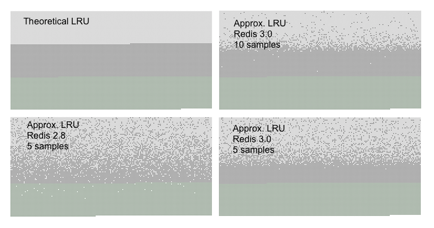

当Redis作为缓存时，通常很方便让它在添加新数据时自动驱逐旧数据。这种行为在开发者社区中是众所周知的，因为它是流行的memcached系统的默认行为。

这个页面涵盖了更一般的主题：Redis `maxmemory` 指令用于限制内存使用量。它还详细介绍了 Redis 使用的 LRU 驱逐算法，实际上是对精确 LRU 的近似实现。

`Maxmemory` 配置指令

`maxmemory`配置指令用于配置Redis在数据集中使用指定数量的内存。您可以使用`redis.conf`文件或后来使用`CONFIG SET`命令来设置配置指令。

例如，要配置一个100兆字节的内存限制，您可以在`redis.conf`文件中使用以下指令：

    maxmemory 100mb

将`maxmemory`设置为零将导致没有内存限制。这是64位系统的默认行为，而32位系统使用隐式的内存限制为3GB。

当达到指定的内存量时，如何配置**淘汰策略**决定了默认的行为。Redis 可以返回可能导致内存使用更多的命令错误，或者在每次添加新数据时淘汰一些旧数据以返回到指定的限制。

## 驱逐政策

Redis在达到`maxmemory`限制时的确切行为是通过`maxmemory-policy`配置指令进行配置的。

以下策略可供选择：

* **noeviction**: 当达到内存限制时，不保存新值。适用于主数据库的复制。
* **allkeys-lru**: 保留最近使用的键；删除最近最少使用的键（LRU原则）。
* **allkeys-lfu**: 保留频繁使用的键；删除最少频繁使用的键（LFU原则）。
* **volatile-lru**: 删除`expire`字段设为`true`的最近不使用的键。
* **volatile-lfu**: 删除`expire`字段设为`true`的最不频繁使用的键。
* **allkeys-random**: 随机删除键以为新添加的数据腾出空间。
* **volatile-random**: 随机删除`expire`字段设为`true`的键。
* **volatile-ttl**: 删除`expire`字段设为`true`且剩余生存时间（TTL）最短的键。

如果没有符合先决条件的键需要驱逐，则策略**volatile-lru**，**volatile-lfu**，**volatile-random**和**volatile-ttl**的行为类似于**noeviction**。

选择正确的驱逐策略对于应用程序的访问模式非常重要，不过在应用程序运行时，您可以重新配置策略，并使用Redis的`INFO`输出来监控缓存未命中和命中的数量，以调整您的设置。

通常来说，有一个经验法则：

* 当您预期请求的流行度符合幂律分布时，请使用**allkeys-lru**策略。也就是说，您预计一部分元素的访问频率远高于其他元素。**如果您不确定，这是个不错的选择**。

* 如果您有一个循环访问的场景，并且所有的键都被连续地扫描，或者您期望分布是均匀的，请使用**allkeys-random**模式。

如果要使用不同的TTL值创建缓存对象，并向Redis提供关于何时过期的提示，请使用**volatile-ttl**。

主要用于在您希望使用单个实例进行缓存和持久键集的情况下使用，**volatile-lru**和**volatile-random**策略通常是非常有用的。然而，通常更好的解决方案是运行两个Redis实例来解决这个问题。

值得注意的是，为键设置`expire`值会消耗内存，因此使用类似于**allkeys-lru**的策略更加节省内存，因为在内存压力下无需对键进行`expire`配置即可使其被驱逐。

## 驱逐流程的工作原理

了解以下事实非常重要，即驱逐流程如下所示：

* 一个客户端运行新的命令，导致更多数据被添加。
* Redis检查内存使用情况，如果大于`maxmemory`限制，则根据策略驱逐键。
* 执行新的命令，依此类推。

所以我们不断地越过内存限制，通过超出限制，然后通过逐出键来返回到限制以下。

如果一个命令导致大量的内存被使用（例如将大型集合交集存储到新键中），在一段时间内可能会超出内存限制的数量。

## 近似LRU算法

Redis LRU算法不是一个精确的实现。这意味着Redis不能选择*最佳候选*进行驱逐，即过去访问最远的键。相反，它将尝试运行LRU算法的近似版本，通过对少量键进行采样，并在采样键中选择最佳的（最老的访问时间）进行驱逐。

然而，自从Redis 3.0以来，该算法已经改进，可以选择一组良好的候选驱逐。这种改进提高了算法的性能，使其能够更好地模拟真实的LRU算法的行为。

Redis LRU算法的重要之处在于，**通过更改检查每次淘汰的样本数量，您可以调整**算法的精度。这个参数由以下配置指令控制：

    maxmemory-samples 5

Redis不使用真正的LRU实现的原因是它会消耗更多的内存。然而，对于使用Redis的应用程序来说，这种近似方法几乎是等效的。下图比较了Redis使用的LRU近似和真正的LRU。



生成上述图表的测试使用了一个具有一定数量键的Redis服务器。这些键按照从第一个到最后一个的顺序进行访问。首个键是使用LRU算法进行驱逐的最佳候选。随后又添加了50%的键，以使旧键的一半被驱逐。

# 在图表中，您可以看到三种不同的点，形成了三个明显的区域。

* 浅灰色的带子表示被驱逐的对象。
* 灰色的带子表示未被驱逐的对象。
* 绿色的带子表示被添加的对象。

在理论上的LRU实现中，我们预计，在旧的键中，前一半将过期。然而Redis的LRU算法只会以一种*概率化*的方式过期较旧的键。

正如您所看到的，与Redis 2.8相比，Redis 3.0在5个样本上做得更好，但是大多数最近访问的对象仍然由Redis 2.8保留。在Redis 3.0中使用样本大小为10，近似值非常接近Redis 3.0的理论性能。

请注意，LRU仅是一种模型，用于预测未来访问给定键的可能性。此外，如果您的数据访问模式与幂律紧密相似，则大多数访问将在LRU近似算法能够处理良好的键集合中。

在模拟中，我们发现使用幂律访问模式时，真实的LRU和Redis的近似之间的差异很小或不存在。

然而，您可以将样本大小增加到10，以更接近真实的LRU，但这会增加一些额外的CPU使用率，然后检查这是否会对缓存不中命中率产生影响。

为了在生产环境中使用不同的样本大小值进行实验，可以使用`CONFIG SET maxmemory-samples <count>`命令，非常简单。

## 新的LFU模式

从Redis 4.0开始，[最不常用驱逐模式](http://antirez.com/news/109)可用。在某些情况下，该模式可能效果更好（提供更好的命中/未命中比率）。在LFU模式下，Redis将尝试跟踪项的访问频率，以便很少使用的项被驱逐。这意味着经常使用的键有更高的机会保留在内存中。

要配置LFU模式，可使用以下策略:

* `volatile-lfu` 使用近似 LFU 算法从具有过期时间集合的键中选择要驱逐的键。
* `allkeys-lfu` 使用近似 LFU 算法驱逐任意键。

LFU被近似为LRU：它使用一种叫做[莫里斯计数器](https://en.wikipedia.org/wiki/Approximate_counting_algorithm)的概率计数器，使用每个对象只需少量比特来估计对象的访问频率，并结合衰减周期，以便随着时间的推移减少计数器的值。在某个时刻，即使过去访问过这些键，我们也不再希望将其视为频繁访问的键，以便算法能够适应访问模式的改变。

这些信息的采样方式与LRU类似（如此文档的前一部分所解释的），用于选择一个适合被替换的候选项。

然而，与LRU不同，LFU有一些可调参数：例如，如果一个频繁访问的项目不再被访问，它应该以多快的速度降低其排名？还可以调整莫里斯计数器的范围，以更好地适应特定的用例。

默认情况下，Redis的配置如下：

* 将计数器饱和在大约一百万次请求左右。
* 每一分钟衰减一次计数器。

这些应该是合理的值，并且经过了实际测试，但是用户可能希望按照自己的需求调整这些配置设置以选择最佳值。

有关如何调整这些参数的说明可以在源代码分发中的示例`redis.conf`文件中找到。简而言之，它们是：

```
lfu-log-factor 10
lfu-decay-time 1
```

衰变时间就是明显的一个，它是计数器应该衰变的分钟数，当取样并发现其年龄超过该值时。特殊值`0`表示：我们永远不会衰变计数器。

计数器*对数因子*会改变饱和频率计数器所需的点击次数，范围为0-255。因子越高，需要更多的访问次数才能达到最大值。因子越低，计数器对于较低访问的分辨率越好，根据以下表格：

```
+--------+------------+------------+------------+------------+------------+
| factor | 100 hits   | 1000 hits  | 100K hits  | 1M hits    | 10M hits   |
+--------+------------+------------+------------+------------+------------+
| 0      | 104        | 255        | 255        | 255        | 255        |
+--------+------------+------------+------------+------------+------------+
| 1      | 18         | 49         | 255        | 255        | 255        |
+--------+------------+------------+------------+------------+------------+
| 10     | 10         | 18         | 142        | 255        | 255        |
+--------+------------+------------+------------+------------+------------+
| 100    | 8          | 11         | 49         | 143        | 255        |
+--------+------------+------------+------------+------------+------------+
```

所以基本上，因子是在更好地区分低访问物品与区分高访问物品之间权衡的因素。更多信息可在示例 `redis.conf` 文件中找到。
